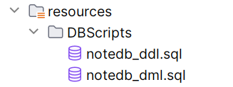
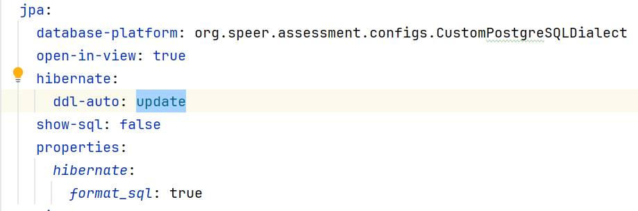

# Getting Started

### Prerequisites

- Java 11 or higher
- Maven 3.6.3 or higher
- PostgreSQL

### **Installation**

**1. Clone the repository:**

   ```bash
   git clone https://github.com/jazzcowboy616/notesapi.git
   cd notesapi

**2. Create the database:**

   ```sql
   CREATE
   DATABASE notedb
      WITH
      OWNER = postgres
      ENCODING = 'UTF8'
      LC_COLLATE = 'en_US.UTF-8'
      LC_CTYPE = 'en_US.UTF-8'
      LOCALE_PROVIDER = 'libc'
      TABLESPACE = pg_default
      CONNECTION LIMIT = -1
      IS_TEMPLATE = False;
   ```

**3. Configure the database:**

   ```yaml
   spring:
      datasource:
         driver-class-name: org.postgresql.Driver
         url: jdbc:postgresql://localhost:5432/notedb
         username: username
         password: password
   ```

**4. Execute DDL and DML scripts:**

You can directly execute the DDL and DML scripts in the `src/main/resources/DBScripts` directory to create the tables
and insert the initial data.


Of course, you can also change the jpa config in `application.yml` to let application create the tables automatically.


### **Run**

**Linux:**

   ```bash
   cd ${application.home}
   ./mvn spring-boot:run
   ```

**Windows:**

   ```bash
   cd ${application.home}
   mvnw.cmd spring-boot:run
   ```

   ```
   $ ./mvnw spring-boot:run
   .   ____          _            __ _ _
   /\\ / ___'_ __ _ _(_)_ __  __ _ \ \ \ \
   ( ( )\___ | '_ | '_| | '_ \/ _` | \ \ \ \
   \\/  ___)| |_)| | | | | || (_| |  ) ) ) )
   '  |____| .__|_| |_|_| |_\__, | / / / /
   =========|_|==============|___/=/_/_/_/

   :: Spring Boot ::                (v3.3.1)

   2024-07-16T11:51:22.309-07:00  INFO 8828 --- [notesapi] [           main] o.s.assessment.AssessmentApplication     : Starting AssessmentApplication using Java 17.0.10 with PID 8828 (C:\Work\java\Workspace\notesapi\target\classes started by w_hun in C:\Work\java\Workspace\notesapi)
   2024-07-16T11:51:22.311-07:00  INFO 8828 --- [notesapi] [           main] o.s.assessment.AssessmentApplication     : No active profile set, falling back to 1 default profile: "default"
   2024-07-16T11:51:22.803-07:00  INFO 8828 --- [notesapi] [           main] .s.d.r.c.RepositoryConfigurationDelegate : Bootstrapping Spring Data JPA repositories in DEFAULT mode.
   2024-07-16T11:51:22.850-07:00  INFO 8828 --- [notesapi] [           main] .s.d.r.c.RepositoryConfigurationDelegate : Finished Spring Data repository scanning in 42 ms. Found 2 JPA repository interfaces.
   2024-07-16T11:51:23.065-07:00  WARN 8828 --- [notesapi] [           main] trationDelegate$BeanPostProcessorChecker : Bean 'org.springframework.ws.config.annotation.DelegatingWsConfiguration' of type [org.springframework.ws.config.annotation.DelegatingWsConfiguration$$SpringCGLIB$$0] is not eligible for getting processed by all BeanPostProcessors (for example: not eligible for auto-proxying). The currently created BeanPostProcessor [annotationActionEndpointMapping] is declared through a non-static factory method on that class; consider declaring it as static instead.
   2024-07-16T11:51:23.085-07:00  INFO 8828 --- [notesapi] [           main] .w.s.a.s.AnnotationActionEndpointMapping : Supporting [WS-Addressing August 2004, WS-Addressing 1.0]
   2024-07-16T11:51:23.409-07:00  INFO 8828 --- [notesapi] [           main] o.s.b.w.embedded.tomcat.TomcatWebServer  : Tomcat initialized with port 8080 (http)
   2024-07-16T11:51:23.416-07:00  INFO 8828 --- [notesapi] [           main] o.apache.catalina.core.StandardService   : Starting service [Tomcat]
   2024-07-16T11:51:23.417-07:00  INFO 8828 --- [notesapi] [           main] o.apache.catalina.core.StandardEngine    : Starting Servlet engine: [Apache Tomcat/10.1.25]
   2024-07-16T11:51:23.464-07:00  INFO 8828 --- [notesapi] [           main] o.a.c.c.C.[Tomcat].[localhost].[/]       : Initializing Spring embedded WebApplicationContext
   2024-07-16T11:51:23.465-07:00  INFO 8828 --- [notesapi] [           main] w.s.c.ServletWebServerApplicationContext : Root WebApplicationContext: initialization completed in 1117 ms
   2024-07-16T11:51:23.570-07:00  INFO 8828 --- [notesapi] [           main] o.hibernate.jpa.internal.util.LogHelper  : HHH000204: Processing PersistenceUnitInfo [name: default]
   2024-07-16T11:51:23.609-07:00  INFO 8828 --- [notesapi] [           main] org.hibernate.Version                    : HHH000412: Hibernate ORM core version 6.5.2.Final
   2024-07-16T11:51:23.634-07:00  INFO 8828 --- [notesapi] [           main] o.h.c.internal.RegionFactoryInitiator    : HHH000026: Second-level cache disabled
   2024-07-16T11:51:23.712-07:00  INFO 8828 --- [notesapi] [           main] com.zaxxer.hikari.HikariDataSource       : HikariPool-1 - Starting...
   2024-07-16T11:51:23.840-07:00  INFO 8828 --- [notesapi] [           main] com.zaxxer.hikari.pool.HikariPool        : HikariPool-1 - Added connection org.postgresql.jdbc.PgConnection@28831d69
   2024-07-16T11:51:23.842-07:00  INFO 8828 --- [notesapi] [           main] com.zaxxer.hikari.HikariDataSource       : HikariPool-1 - Start completed.
   2024-07-16T11:51:24.039-07:00  INFO 8828 --- [notesapi] [           main] o.s.o.j.p.SpringPersistenceUnitInfo      : No LoadTimeWeaver setup: ignoring JPA class transformer
   2024-07-16T11:51:24.699-07:00  INFO 8828 --- [notesapi] [           main] o.h.e.t.j.p.i.JtaPlatformInitiator       : HHH000489: No JTA platform available (set 'hibernate.transaction.jta.platform' to enable JTA platform integration)
   2024-07-16T11:51:24.798-07:00  INFO 8828 --- [notesapi] [           main] j.LocalContainerEntityManagerFactoryBean : Initialized JPA EntityManagerFactory for persistence unit 'default'
   2024-07-16T11:51:25.196-07:00  INFO 8828 --- [notesapi] [           main] eAuthenticationProviderManagerConfigurer : Global AuthenticationManager configured with AuthenticationProvider bean with name authenticationProvider
   2024-07-16T11:51:25.197-07:00  WARN 8828 --- [notesapi] [           main] r$InitializeUserDetailsManagerConfigurer : Global AuthenticationManager configured with an AuthenticationProvider bean. UserDetailsService beans will not be used for username/password login. Consider removing the AuthenticationProvider bean. Alternatively, consider using the UserDetailsService in a manually instantiated DaoAuthenticationProvider.
   2024-07-16T11:51:25.526-07:00  INFO 8828 --- [notesapi] [           main] o.s.b.w.embedded.tomcat.TomcatWebServer  : Tomcat started on port 8080 (http) with context path '/'
   2024-07-16T11:51:25.533-07:00  INFO 8828 --- [notesapi] [           main] o.s.assessment.AssessmentApplication     : Started AssessmentApplication in 3.565 seconds (process running for 3.848)
   ```

Now you can access the application at `http://localhost:8080`

**Note:**
log file at `logs/notesapi.log`